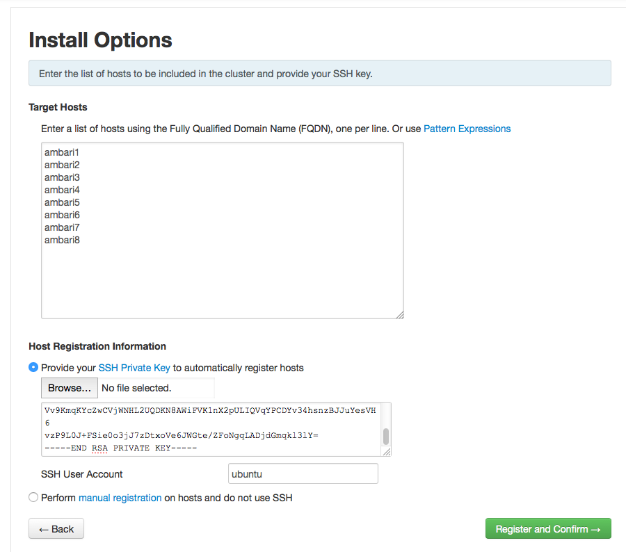
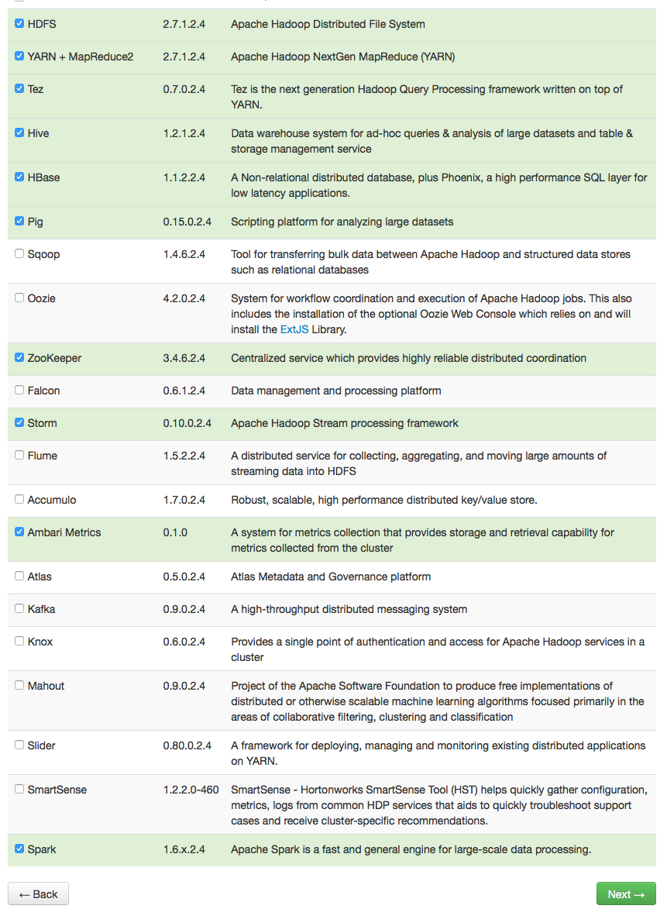

# Use the Hortonworks Ambari on SWITCHengines

In this tutorial we are going to install a Big Data Cluster on SWITCHengines
using Ambari from the Hortonworks Hadoop distribution

## Run the Ansible playbook

Create your config file:

```
cp vars.yaml.template vars.yaml
vim vars.yaml
```

Source your openstack config:

```
source ~/openrc
```

Run the playbook

```
export ANSIBLE_HOST_KEY_CHECKING=False
ansible-playbook main.yaml
```

The ansible playbook will:
 * Create a new ssh key
 * Start 8 c1.xlarge virtual machines (ubuntu)
 * Install the Ambari repository
 * Fix the /etc/hosts with Openstack internal addresses
 * Install Ambari Server on the first VM


Check the public IP address of the ambari1 server

```
openstack server list
```

Point your browser to http://ambari1:8080

Login as `admin` password `admin`

At the install options screen, just have to type the names of your VMs, past the private key that you find the file `id_rsa_ambari`
(this file is generated when you run the ansible playbook) and specify that the username to use is `ubuntu`



Proceed with the default settings for everything. When you are asked to Choose Service if unsure you can use the following setup. 



